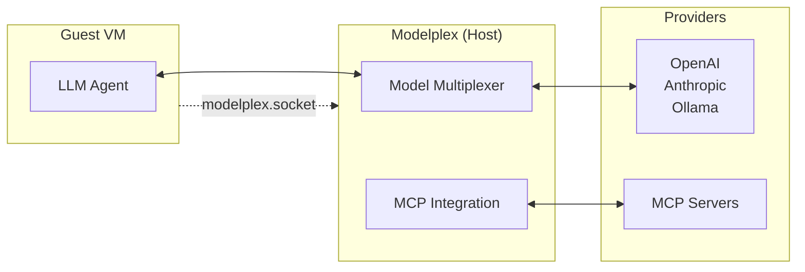

# Modelplex

Decouple models and MCP integrations from the agent.

**With modelplex, we can run AI agents in complete network isolation.** No outbound connections. Full AI capabilities.



## Features

**🔀 Model Multiplexer**
- Use any model through one OpenAI-compatible interface
- Manage API keys and secrets in modelplex, so your agent doesn't need to know about them.

**🔒 Zero Network Dependencies**
- Unix domain socket communication only
- Run agents in a VM without a network device!

**📊 Full Observability**
- Structured logging with slog
- Monitor every AI interaction

## Quick Start

```bash
# Build from source
git clone https://github.com/shazow/modelplex.git
cd modelplex
go build -o modelplex ./cmd/modelplex
```

Create `config.toml`:

```toml
# Multi-provider configuration with failover
[[providers]]
name = "openai"
type = "openai"
base_url = "https://api.openai.com/v1"
api_key = "${OPENAI_API_KEY}"
models = ["gpt-4", "gpt-3.5-turbo"]
priority = 1

[mcp]
enabled = true
servers = [
    { name = "filesystem", command = "mcp-server-filesystem", args = ["/workspace"] },
]
```

### 3. Start Modelplex

```bash
# Host system (with network access)
./modelplex --config config.toml --socket ./modelplex.socket --verbose
```

### 4. Connect with an agent

```python
# Isolated agent environment (Python)
import openai

client = openai.OpenAI(
    base_url="unix:/path/to/modelplex.socket",
    api_key="unused"  # Not needed, handled by host
)

# Works exactly like normal OpenAI, but completely isolated
response = client.chat.completions.create(
    model="gpt-4",
    messages=[{"role": "user", "content": "Hello from isolation!"}]
)

print(response.choices[0].message.content)
```

```javascript
// Isolated agent environment (Node.js)
import OpenAI from 'openai';

const client = new OpenAI({
  baseURL: 'unix:/path/to/modelplex.socket',
  apiKey: 'unused'
});

const response = await client.chat.completions.create({
  model: 'claude-3-sonnet',
  messages: [{ role: 'user', content: 'Hello from isolation!' }]
});
```

```bash
# Isolated agent environment (curl)
curl --unix-socket ./modelplex.socket \
  -X POST http://localhost/v1/chat/completions \
  -H "Content-Type: application/json" \
  -d '{
    "model": "gpt-4",
    "messages": [{"role": "user", "content": "Hello!"}]
  }'
```


## Docker

```bash
# Build and run
docker build -t modelplex .
docker run -v /path/to/config.toml:/config.toml \
           -v /path/to/socket:/socket \
           modelplex --config /config.toml --socket /socket/modelplex.socket
```

## Roadmap

### Core Features
- [ ] **Real-time configuration updates** without restart
- [ ] **Advanced monitoring dashboard** with metrics and alerts  
- [ ] **Additional AI provider integrations** (Google AI, Azure OpenAI)
- [ ] **WebSocket support** for streaming responses
- [ ] **Load balancing** across multiple provider instances
- [ ] **Request caching** and response optimization

### MCP Enhancements
- [ ] **MCP Pass-through Proxy** - Allow external MCP clients to connect through Modelplex
- [ ] **Tool aggregation from multiple MCP servers** with conflict resolution
- [ ] **MCP server implementation** for external client connections
- [ ] **Enhanced MCP tool integration** with permission controls and namespacing
- [ ] **MCP protocol transport options** beyond stdin/stdout

### Developer Experience
- [ ] **Plugin system** for custom providers and tools
- [ ] **Configuration validation** and schema documentation
- [ ] **Performance profiling** and optimization tools
- [ ] **Integration examples** for popular frameworks and platforms

## License

MIT
